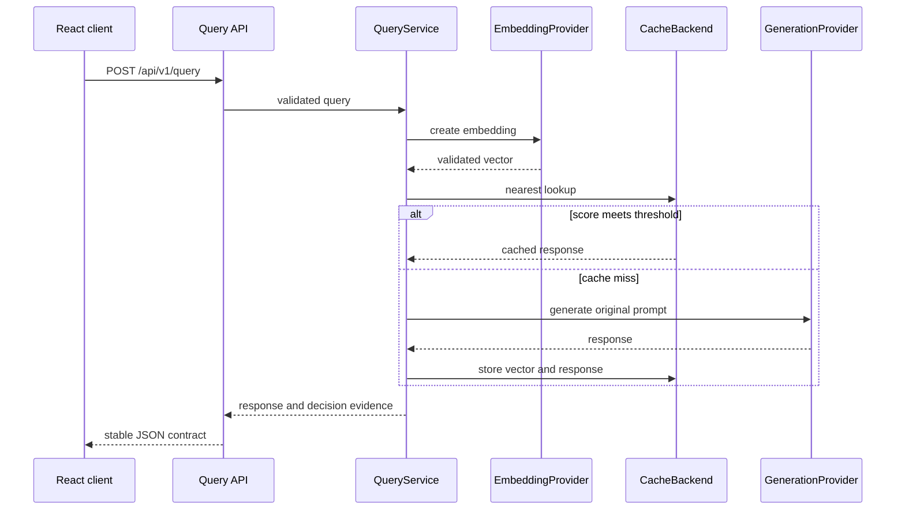

# Architecture

Semantix is a feature-first full-stack application. Features own their API,
orchestration, domain rules, and infrastructure only where those
responsibilities exist. Shared packages contain cross-feature composition and
utilities rather than feature behavior.

## Runtime flow



Identical in-flight requests are coalesced before repeated provider work.
Runtime counters observe the query path without storing prompt or response
content.

## Backend ownership

- `app/api` composes feature routers and cross-feature dependencies.
- `app/query/api` owns the query HTTP contract.
- `app/query/application` coordinates lookup, generation, storage, timing, and
  request coalescing.
- `app/query/domain` owns prompt normalization and effective cache policies.
- `app/cache/api` owns inspection, statistics, threshold, and invalidation
  routes.
- `app/cache/application` exposes semantic lookup and storage behavior.
- `app/cache/domain` owns keys, namespaces, metadata, vector validation, models,
  and backend ports.
- `app/cache/infrastructure` owns memory and pgvector adapters, database
  connectivity, and migrations.
- `app/benchmark` mirrors API, application, and domain responsibilities for the
  isolated evaluation laboratory.
- `app/providers` owns application-facing protocols, startup composition, and
  concrete external adapters.
- `app/observability` stays flat because it is a small cohesive feature with one
  endpoint and one process-local collector.
- `app/core` owns configuration, errors, logging, and shared limits.

Routes and application services depend on protocols rather than concrete
provider or storage adapters. Startup composition in `app/lifecycle.py` and
provider/cache factories selects implementations from validated settings.

## Provider and cache ports

Embedding and generation use separate ports:

```python
class EmbeddingProvider(Protocol):
    async def create_embedding(self, text: str) -> Sequence[float]: ...


class GenerationProvider(Protocol):
    async def generate(self, prompt: str) -> str: ...
```

This permits combinations such as OpenAI embeddings with Anthropic generation.
The selected embedding dimensions flow into validation and cache composition;
vectors are never padded or truncated.

The cache application layer uses one backend port implemented by memory and
pgvector adapters. Both enforce compatible lookup, TTL, LRU, namespaces,
inspection, and statistics behavior.

## Frontend ownership

The React application has five lazy workspaces:

| Route | Feature |
|---|---|
| `/` | Query monitor, decision evidence, similarity trace, and session log |
| `/cache` | Cache inspection, search, sorting, deletion, and clearing |
| `/benchmarks` | Isolated controlled evaluation |
| `/observability` | Process-local runtime metrics |
| `*` | Not-found page |

Each feature owns its pages, components, hooks, API adapter, types, and route
registry. `src/app/router` composes those registries and provides the shared
lazy loader. Shared providers keep cache statistics, threshold state, and the
monitor trace session alive across client-side navigation.

Monitor traces intentionally live in browser memory. Reloading starts a new
trace session; backend cache entries follow the configured cache lifecycle.
Benchmark state is route-local and does not modify the interactive cache.

## Project structure

```text
semantix/
├── backend/
│   ├── app/
│   │   ├── api/
│   │   ├── benchmark/{api,application,domain}/
│   │   ├── cache/{api,application,domain,infrastructure}/
│   │   ├── embedding/
│   │   ├── observability/
│   │   ├── providers/{adapters,shared}/
│   │   ├── query/{api,application,domain}/
│   │   ├── core/
│   │   ├── factory.py
│   │   ├── lifecycle.py
│   │   └── main.py
│   └── tests/                    # Mirrors feature ownership
├── frontend/
│   ├── src/
│   │   ├── app/
│   │   ├── features/
│   │   └── shared/
│   └── tests/                    # Mirrors app and features
├── ops/
│   ├── postgres/
│   └── load-tests/
├── docs/
└── docker-compose.yml
```

## Deployment boundary

The supplied deployment is intentionally single-instance and local-first:

- rate limiting, coalescing, and runtime metrics are process-local;
- cache-management endpoints are unauthenticated;
- CORS is configured for known local frontend origins;
- no distributed lock, message bus, or external metrics platform is included.

Production adaptation requires authentication, secret management, TLS,
distributed coordination where multiple replicas share work, and an explicit
data-retention model.
