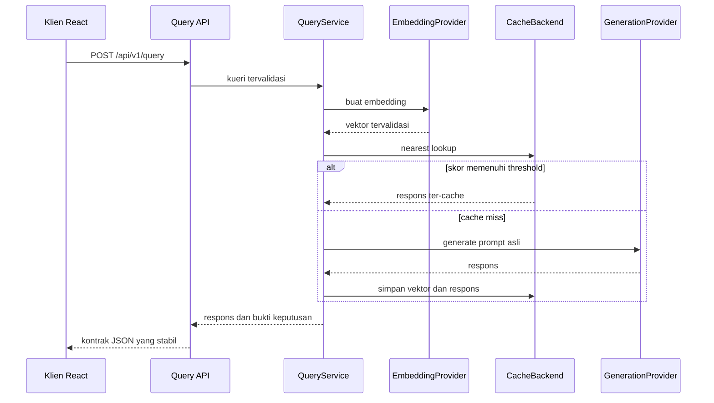

# Architecture

Semantix adalah aplikasi full-stack yang mengutamakan struktur feature-first. Fitur (feature) memiliki API, orkestrasi, aturan domain, dan infrastrukturnya sendiri — hanya untuk tanggung jawab yang memang menjadi miliknya. Paket bersama (shared packages) berisi komposisi lintas-fitur dan utilitas, bukan perilaku fitur itu sendiri.

## Alur Runtime



Request identik yang sedang berjalan (in-flight) akan digabungkan (coalesced) sebelum pekerjaan provider yang berulang dilakukan. Counter runtime mengamati alur query tanpa menyimpan konten prompt atau respons.

## Kepemilikan Backend

- `app/api` menyusun (compose) router fitur dan dependency lintas-fitur.
- `app/query/api` memiliki kontrak HTTP untuk query.
- `app/query/application` mengoordinasikan lookup, generation, penyimpanan, timing, dan request coalescing.
- `app/query/domain` memiliki normalisasi prompt dan cache policy yang efektif.
- `app/cache/api` memiliki route inspection, statistik, threshold, dan invalidation.
- `app/cache/application` mengekspos perilaku semantic lookup dan penyimpanan.
- `app/cache/domain` memiliki key, namespace, metadata, validasi vektor, model, dan backend port.
- `app/cache/infrastructure` memiliki adapter memory dan pgvector, konektivitas database, dan migrasi.
- `app/benchmark` mencerminkan tanggung jawab API, application, dan domain untuk laboratorium evaluasi yang terisolasi.
- `app/providers` memiliki protokol yang menghadap ke application, komposisi startup, dan adapter provider eksternal yang konkret.
- `app/observability` tetap flat (datar) karena merupakan fitur kohesif kecil dengan satu endpoint dan satu collector process-local.
- `app/core` memiliki konfigurasi, error, logging, dan limit bersama.

Route dan application service bergantung pada protokol, bukan adapter provider atau storage yang konkret. Komposisi startup pada `app/lifecycle.py` serta factory provider/cache memilih implementasi berdasarkan pengaturan (settings) yang telah tervalidasi.

## Port Provider dan Cache

Embedding dan generation menggunakan port yang terpisah:

```python
class EmbeddingProvider(Protocol):
    async def create_embedding(self, text: str) -> Sequence[float]: ...


class GenerationProvider(Protocol):
    async def generate(self, prompt: str) -> str: ...
```

Hal ini memungkinkan kombinasi seperti embedding OpenAI dengan generation Anthropic. Embedding dimensions yang dipilih mengalir ke dalam validasi dan komposisi cache; vektor tidak pernah di-padding atau dipotong (truncated).

Application layer cache menggunakan satu cache backend port yang diimplementasikan oleh adapter memory dan pgvector. Keduanya menerapkan perilaku lookup, TTL, LRU, namespace, inspection, dan statistik yang kompatibel.

## Kepemilikan Frontend

Aplikasi React memiliki lima workspace yang lazy-loaded:

| Route | Fitur |
|---|---|
| `/` | Query monitor, bukti keputusan, similarity trace, dan session log |
| `/cache` | Inspeksi cache, pencarian, pengurutan, penghapusan, dan pembersihan |
| `/benchmarks` | Evaluasi terkontrol yang terisolasi |
| `/observability` | Metrik runtime process-local |
| `*` | Halaman not-found |

Setiap fitur memiliki pages, components, hooks, API adapter, types, dan route registry-nya sendiri. `src/app/router` menyusun (compose) registry tersebut dan menyediakan lazy loader bersama. Provider bersama menjaga statistik cache, state threshold, dan session trace monitor tetap hidup selama navigasi sisi klien (client-side navigation).

Monitor trace sengaja disimpan dalam memori browser. Memuat ulang (reload) akan memulai session trace baru; entri cache backend mengikuti siklus hidup cache yang telah dikonfigurasi. State benchmark bersifat route-local dan tidak mengubah cache interaktif.

## Struktur Proyek

```text
semantix/
├── backend/
│   ├── app/
│   │   ├── api/
│   │   ├── benchmark/{api,application,domain}/
│   │   ├── cache/{api,application,domain,infrastructure}/
│   │   ├── embedding/
│   │   ├── observability/
│   │   ├── providers/{adapters,shared}/
│   │   ├── query/{api,application,domain}/
│   │   ├── core/
│   │   ├── factory.py
│   │   ├── lifecycle.py
│   │   └── main.py
│   └── tests/                    # Mencerminkan kepemilikan fitur
├── frontend/
│   ├── src/
│   │   ├── app/
│   │   ├── features/
│   │   └── shared/
│   └── tests/                    # Mencerminkan app dan features
├── ops/
│   ├── postgres/
│   └── load-testing/
├── docs/
└── docker-compose.yml
```

## Batasan Deployment

Deployment yang disediakan sengaja bersifat single-instance dan local-first:

- rate limiting, coalescing, dan metrik runtime bersifat process-local;
- endpoint cache-management tidak terautentikasi;
- CORS dikonfigurasi untuk origin frontend lokal yang telah diketahui;
- tidak ada distributed lock, message bus, atau platform metrik eksternal yang disertakan.

Adaptasi produksi memerlukan autentikasi, manajemen secret, TLS, koordinasi terdistribusi ketika beberapa replica berbagi pekerjaan, dan model data-retention yang eksplisit.